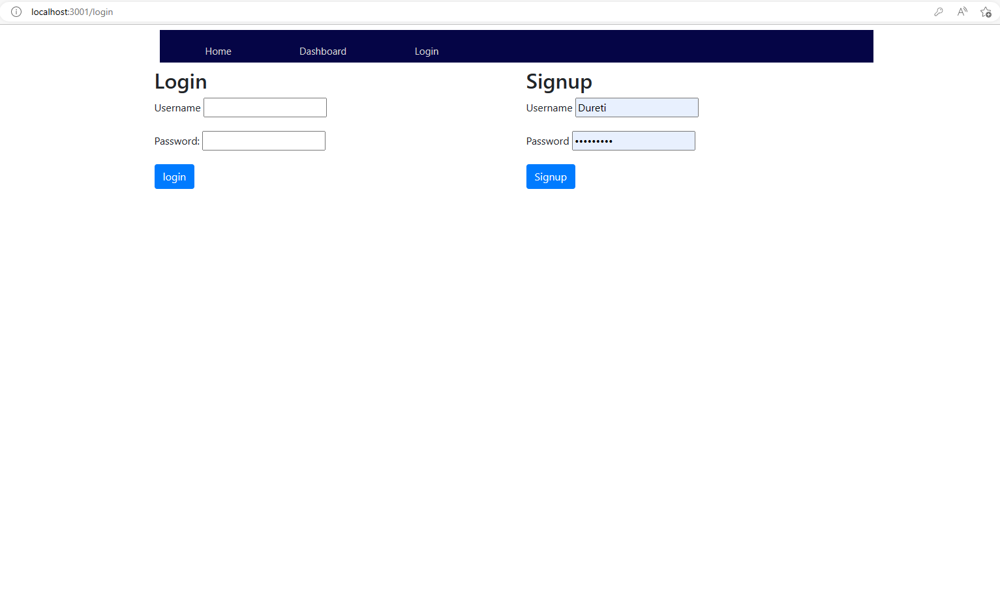
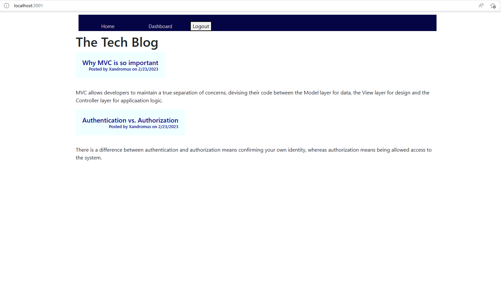
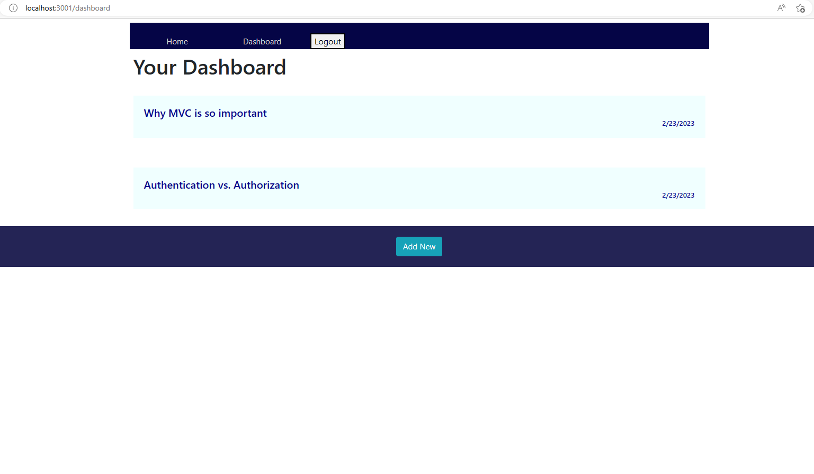

# MVC-Tech-Blog
## Table of Content
- [Description](#description)
- [Links](#links)
- [Screenshots](#screenshots)
- [Installation](#installation)
- [Test](#test)
- [License](#license)
-------------------------------------
## Description
This app is a blog site where developers can publish their blog posts and comment on other developers' posts. A user must sign up to get access of this site which includes adding comments to other poeples' posts. This site enables users to edit/update or delete their own previously posted blogs. MySQL Database, Express.js, Sequelize, express-handlebars, bcrypt package, dotenv package, express-session packages and ofcourse JS,CSS and Bootstrap were used for this application. 

--------------------------------------

## Links
   Deployed App => https://still-castle-11167.herokuapp.com/

## Screenshots

## Installaion

"npm install"

## Test 

"node server.js" or "npm start"
   
---------------------------------------
## License 
MIT License

